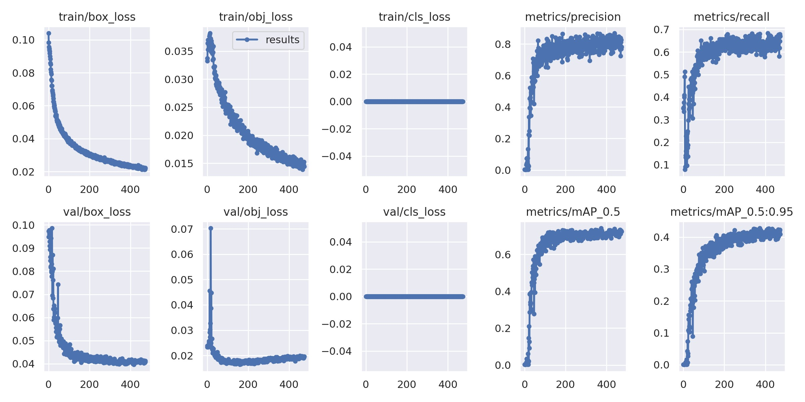

<!-- also include results and takeaways here? -->
Our implementation has three main portions. The first is the trained YOLOv5 [model](#model) that detects potholes out of images and videos. The second part is an additional layer of functionality that allows users to upload their own photos and run the model over those via a [web application](#our-web-application). The third and final part is a [map](#pothole-mapping) of user submissions, plotting the location of potholes in an area using metadata from the user image. 
 

## Model
We decided to use a YOLO (You Only Look Once) model for object detection. We settled on this approach because the current research points to this being the most efficient for detection. To get started, we found a dataset of potholes in order to train our model. We used a YOLO skeleton we found online and tweaked it for our use. The model was written and hosted on Google Collab for training. Using our dataset and other sources, we trained our model up to 1000 epochs. The best results were observed at epoch 373 and the model stopped training early at epoch 474 as improvements were not observed. After training the model, we generated performance metrics for the bounding box creation and the actual object detection. 

<!-- insert graph of metrics -->

We measured the both the training and validation loss for both bounding box creation and pothole detection. Loss represents how far away our model is from making accurate predictions. It can and should trend to zero and we were trying to minimize the loss in the given areas. Validation loss occurs at the end of an epoch by comparing the output to the validation dataset. Training loss occurs at the end of each step inside an epoch as the model is trying to improve the loss. Above, we can see that both training and validation loss are trending downward for pothole detection and bounding box generation, which is a good indicator that our model has high accuracy.  

We also measured mAP, the Mean Average Performance of the model. mAP is a formula that considers the confusion matrix, intersection over region, recall, and precision. A higher mAP indicates a higher performing ML model. In our case, these metrics aren't the best as our mAP is around 71%. However, this can be explained as a higher mAP can also indicate an over-fitting of data, and we optimized our model to reduce over-detection. 

The final two metrics were precision and recall.  Precision is the fraction of relevant instances compared to retrieved instances, which measures how many objects are correctly classified. Recall is the fraction of relevant instances that were retrieved, which measures the percentage of true postives vs. false positives. Having a high number for both of these metrics is encouraging, as it suggests that the model is correctly detecting potholes. Our precision metrics is around 80% and our recall is around 70%, which aren't amazing but do show that our model is working correctly a high majority of the time. In our own tests images, there were no cases in which a pothole was not detected or the model drew a bounding box around something that was not a pothole. 

### Model: Results
Our model outputs these images, with bounding boxes drawn around the detected potholes and a numerical indication of how confident the model is in its detection. Some output images can be seen below:

 

 

 
We wanted to include this image to show that when no potholes are detected, the model also recognizes that and does not draw any bounding boxes or identification markers.

### Model: Problems Encountered
The biggest problem with the model was just chosing which CNN to use, which is covered in more detail on the background page. Beyond that, most of the troubleshooting was tinkering with the training, seeing how many epochs created the optimal model, and getting the model to communicate with the Python code for the user upload functionality. These problems were easily overcome with trial and error. 

## Our Web Application

### Frameworks and Tools

The web application was built using the framework [flask](https://flask.palletsprojects.com/en/2.2.x/), which faciliated the process of creating files to populate for a web app that involves user uploads. We added the yolo repository to the flask setup, which made it such that we could send any user-uploaded image to the model we had already trained, without needing to re-train each time. 

We also used a Python virtual environment to iteratively develop and see our results on a local web page. 

### The Application: Backend

In our `app.py`, we implemented the following restAPI methods:
1. `detect`, POST method: saves the user-uploaded photo/video
2. `opencam`, GET method: opens user's front camera and running our `detect.py` on it to draw labeling boxes around potholes over real-time video footage.
3. `return-files`, GET method: returns annotated version of user-uploaded image 

### Interaction with YOLO

After we trained our model, we preserved `best.pt`, the file with weights that yielded the most accurate results. Then, we used our `detect.py` in conjunction with these weights to perform object detection on each new photo/video without needing to re-train the model.

### The Application: Frontend

To create the frontend visuals of our web application, we built out simple `html` files and populated them with the buttons and links we wanted. We added attributes that called the appropriate backend methods when the respective buttons were clicked. Additionally, we created a second `html` file for the functionality of our clickable "Download" button appearing after the object-detection had completed. 

### Web App: Results of User Uploads
# link to upload page

### Web App: Problems Encountered

The intention of this functionality is to notify government officials of potholes in specific areas so that the time typically taken for screening roads and mapping the ideal route for maintenance and repair is cut down. Because this application can be run on live video, users could attach their dashcams to the model as they are driving -- the survellience process is fully automated in this scenario. Otherwise, pedestrians, bikers, and other commuters could take pictures with their phones and submit that data. Essentially, this step is intended to eliminate the need for road surveys. In order to optimize the repair process, we will use metadata from user uploads to create a map of potholes in a given area.

## Pothole Mapping
The final step of our implementation is mapping the location of images uploaded by users. In order to do this, we hosted a database of images and wrote a JavaScript script to pull the metadata (latitude, longitude coordinates) from each image. The coordinates would then be uploaded to Google Firebase. Our website then pulls all of the coordinates from the database and places a marker at that location. The resulting map is embedded below, with points corresponding to our own collected images to prove correctness of our workflow. 

### Pothole Mapping: Problems Encountered
The main issue we encountered here was trying to connect the backend of the photo upload into the database. What we end up doing was creating a Python mircoservice to download the photos from the upload front-end and upload them back into the database. Then, the main issue was connecting the database back into the website. This ended up taking a bulk of the time because none of us had experience with embedded Javascript elements. The issue ended up just being a syntax error, so once we figured that out our map worked, finishing the flow from user upload to map plot points.

The motivation of adding this, as mentioned, is to improve outcomes of road maintenance. The most costly portion of maintenance is materials, with time cost for mapping an optimal route coming in second. Our map reduces that cost. Not only are the potholes plotted with precision, but we have images of all the potholes at those locations so workers can identify severity, amount of materials needed, estimate repair time, and a number of other features. Some future implementations might include having a shortest-path route generation which would attempt to draw a path that intersects all of the plothole points in the shortest distance possible. This would allow workers to not have to determine an optimal route themseleves and instead follow an optimal computer generated route. 

### Conclusion
Going into this implementation, we set goals to automate the detection of potholes, simplify data collection, and improve the repair process to broadly reduce the presence of potholes. Our YOLO model is able to detect potholes with high accuracy. Users' ability to run the model over dashcam footage, photos, and videos creates a better and simplier way to collect broad data. Mapping those user uploads and plotting an accurate map of local potholes frees time and resources of repair workers. Through these three steps, we have addressed and achieved each of our goals. Hopefully, we can continue to work with this technology to contribute to safer infrastructure across the US and world at large.

